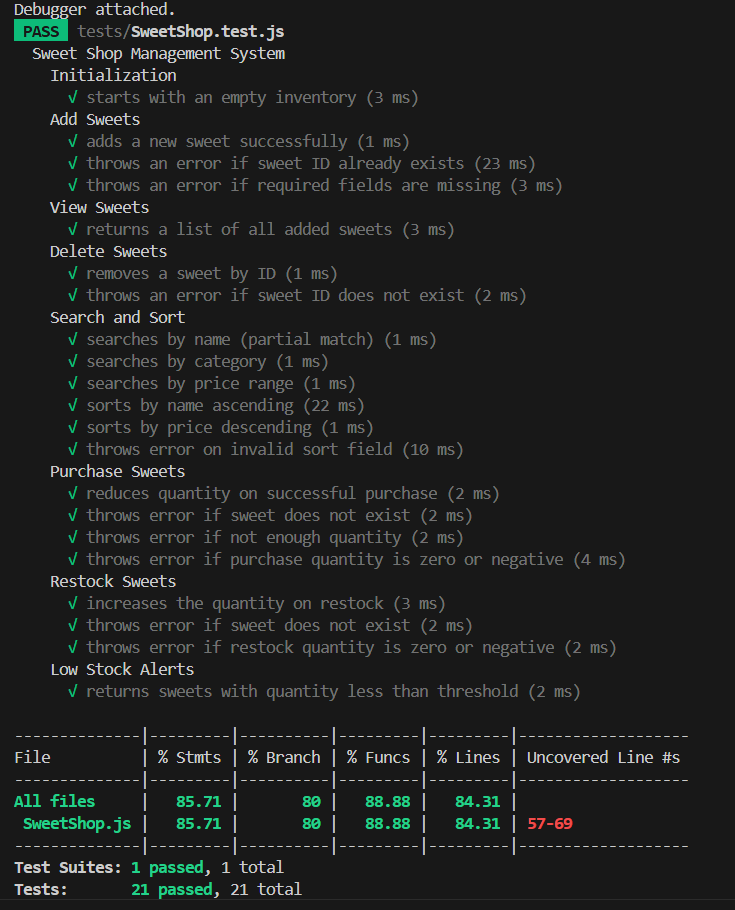

#  Sweet Shop Management System

A fully test-driven backend system for managing sweets inventory, written in **JavaScript (Node.js)** using **Jest** for TDD. Includes a simple frontend UI (HTML + JavaScript).

---

##  Features

- Add new sweets  
- View available sweets  
- Delete sweets  
- Search sweets by name / category / price  
- Sort sweets by name / category / price (asc/desc)  
- Purchase sweets (with stock validation)  
- Restock inventory  
- Low-stock alerts  


## Test-Driven Development (TDD)

This project strictly follows **TDD principles**:

-  Wrote tests before writing implementation  
-  Used Jest for unit testing  
-  Maintained high test coverage  
-  Followed the red-green-refactor cycle  

---

## Tech Stack

| Layer    | Tools Used         |
|----------|--------------------|
| Language | JavaScript (ES6)   |
| Testing  | Jest               |

##  Project Structure

sweet-shop-management-system/
├── src/ # SweetShop class implementation
│ └── SweetShop.js
├── tests/ # Jest test cases
│ └── SweetShop.test.js
├── images/ # Screenshots
│ └── test-report.png
├── package.json
├── README.md

## Personal Learning Note

I want to be transparent about my learning journey:

- Before this project, I had not written a full system using **TDD**.
- I understood the theory of TDD but applied it practically here for the first time.
- I used **ChatGPT** to help guide my TDD process, generate test structure, and identify edge cases.
- All code was written by me. AI was used as a learning assistant — not for copying.

**Through this project, I gained confidence in:**

- Writing unit tests first  
- Building clean business logic  
- Applying object-oriented practices in JavaScript  

---

## Test Report Screenshot



---

## ⚙️ Project Setup

```bash
# Step 1:
git clone https://github.com/VadherRaviR/Sweet-Shop-Management-System.git
cd Sweet-Shop-Management-System

# Step 2:
npm install

# Step 3:
npm test

